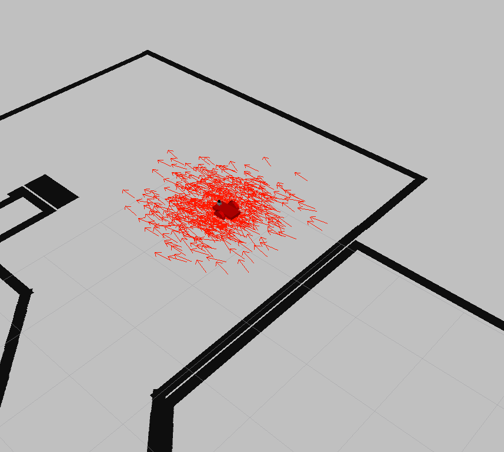
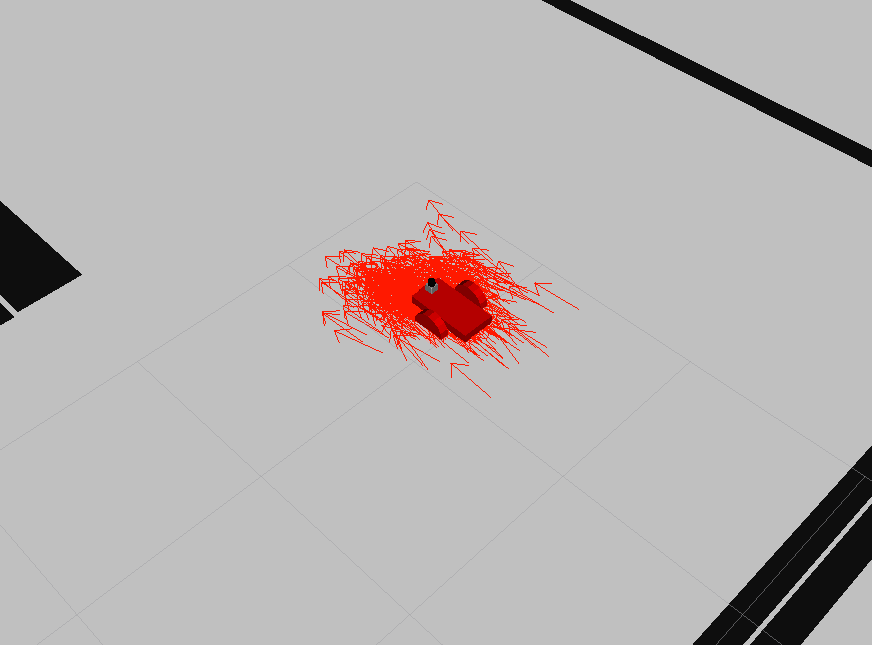
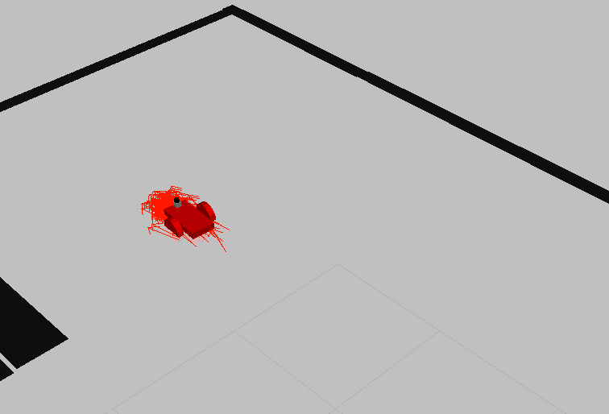

# RoboticsND-Project3
A ROS localization project

## Instructions
### Requirements
- Gazebo 7.x
- ROS Kinetic
- Ubuntu 16.04

### Add non-standard ROS packages
- `$ sudo apt-get install ros-kinetic-navigation`
- `$ sudo apt-get install ros-kinetic-map-server`
- `$ sudo apt-get install ros-kinetic-move-base`
- `$ sudo apt-get install ros-kinetic-amcl`

### Set up
Create a catkin workspace
- `$ mkdir -p ~/catkin_ws/src && cd ~/catkin_ws/src`
- `$ catkin_init_workspace`

Clone and build this repo into the source folder
- `$ git clone https://github.com/davidsmithxc/RoboticsND-Project3 ~/catkin_ws/src`
- `$ cd ~/catkin_ws && catkin_make`

### Launching
- `$ source devel/setup.bash`
- `$ roslaunch my_robot world.launch`
- open another terminal to launch localization
- `$ roslaunch my_robot acml.launch`
- open another terminal to launch rviz
- `$ rosrun rviz rviz -d ~/catkin_ws/src/p3RvizConfig.rviz`
- In RViz, use the 2D waypoint to have the robot drive to a location and localize.

## Results
The robot starts out initially unlocalized

With just a small amount of driving, the robot quickly begins to converge the localization

Quickly the robot localization converges to a good position
