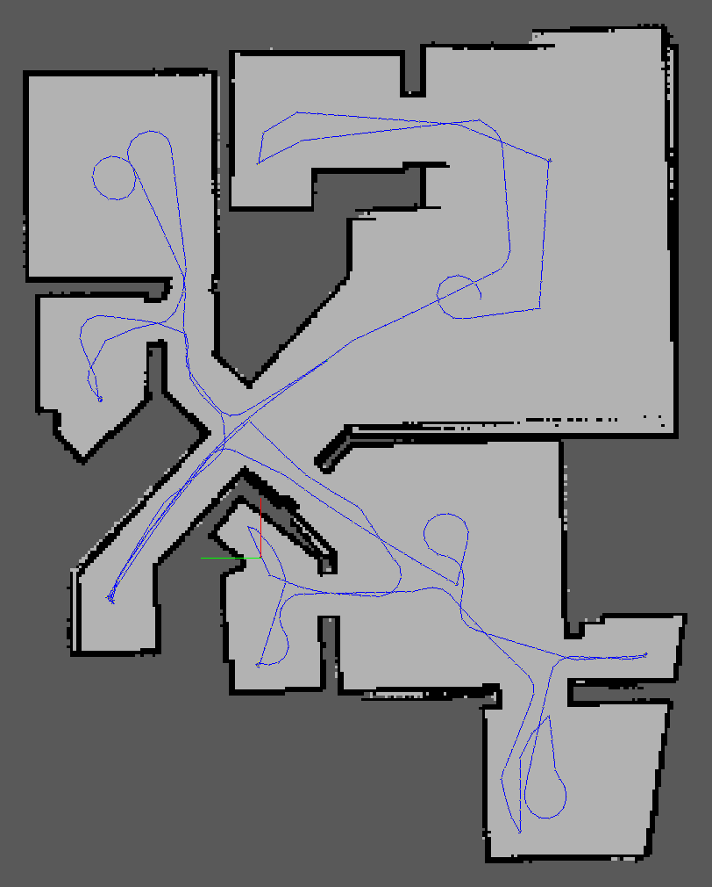

# RoboticsND-Project4: Map My World
A ROS mapping project with rtabmap

## Instructions
### Requirements
- Gazebo 7.x
- ROS Kinetic
- Ubuntu 16.04

### Add non-standard ROS packages
- `$ sudo apt-get install ros-kinetic-navigation`
- `$ sudo apt-get install ros-kinetic-map-server`
- `$ sudo apt-get install ros-kinetic-move-base`
- `$ sudo apt-get install ros-kinetic-amcl`
- `$ sudo apt-get install ros-kinetic-rtabmap-ros`

### Set up
Create a catkin workspace
- `$ mkdir -p ~/catkin_ws/src && cd ~/catkin_ws/src`
- `$ catkin_init_workspace`

Clone and build this repo into the source folder
- `$ git clone https://github.com/davidsmithxc/RoboticsND-Project4 ~/catkin_ws/src`
- `$ cd ~/catkin_ws && catkin_make`

Download rtabmap database [here](https://drive.google.com/file/d/1W7wtt6ZWpD-ojFdZJD-BtYq4L9eG2Zux/view?usp=sharing)

### Launching
- open a terminal and launch the basic world
- `$ source devel/setup.bash`
- `$ roslaunch my_robot world.launch`
- open another terminal to launch the teleop
- `$ rosrun teleop_twist_keyboard teleop_twist_keyboard.py`
- open another terminal to launch localization
- `$ roslaunch my_robot mapping.launch`

## Results
Manually driving the robot around the environment creates the following map


## Project Structure
```
.Project4                          # Where Am I Project
    ├── my_robot                       # my_robot package
    │   ├── launch                     # launch folder for launch files
    │   │   ├── robot_description.launch
    │   │   ├── world.launch
    │   │   ├── amcl.launch
    │   │   ├── mapping.launch
    |   ├── maps                       # maps for use in my world
    |   |   ├── map.pgm
    |   |   ├── map.yaml
    │   ├── meshes                     # meshes folder for sensors
    │   │   ├── hokuyo.dae
    │   ├── urdf                       # urdf folder for xarco files
    │   │   ├── rc_robot.gazebo
    │   │   ├── rc_robot.xacro
    │   ├── worlds                     # world folder for world files
    │   │   ├── apartment_ball.world
    │   │   ├── apartment.world
    │   │   ├── empty.world
    │   ├── CMakeLists.txt             # compiler instructions
    │   ├── package.xml                # package info
    ├── pgm_map_creator                # pgm_map_creator package
    │   ├── launch                     # launch folder for launch files
    │   │   ├── request_publisher.launch
    │   ├── world                      # world files that should be converted
    │   │   ├── my_world.world
    │   ├── maps                       # pgm image files
    │   │   ├── map.pgm
    ├── ball_chaser                    # ball_chaser package
    │   ├── launch                     # launch folder for launch files
    │   │   ├── ball_chaser.launch
    │   ├── src                        # source folder for C++ scripts
    │   │   ├── drive_bot.cpp
    │   │   ├── process_images.cpp
    │   ├── srv                        # service folder for ROS services
    │   │   ├── DriveToTarget.srv
    │   ├── CMakeLists.txt             # compiler instructions
    │   ├── package.xml                # package info
    └──
```
